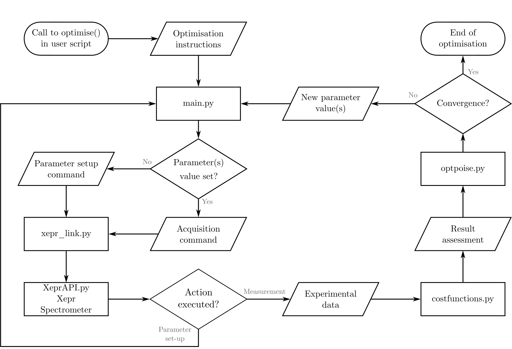

Modules
=======

The esrpoise code is organized into 4 modules:
 - ``main.py`` for the optimisation to take place (set parameters, run the experiment, report results...),
 - ``xepr_link.py`` to handle communication with Xepr,
 - ``costfunctions.py`` which contains standard cost functions,
 - ``optpoise.py`` which contains the necessary for the optimisers (cf. source code for more details).

.. currentmodule:: esrpoise.main

.. automodule:: esrpoise.main

.. autofunction:: optimise

|

.. autofunction:: acquire_esr

|

.. autofunction:: param_set

|

.. autofunction:: round2tol_str

|

xepr_link.py
------------

.. currentmodule:: esrpoise.xepr_link

.. autofunction:: load_xepr

|

.. autofunction:: load_exp

|

.. autofunction:: load_def

|

.. autofunction:: modif_def

|

.. autofunction:: load_shp

|

.. autofunction:: run2getdata_exp

|

.. autofunction:: reset_exp

|

costfunctions.py
----------------

.. currentmodule:: esrpoise.costfunctions

Spectrum
^^^^^^^^

.. autofunction:: spectrum

|

.. autofunction:: minabsint

|

.. autofunction:: maxabsint

|

.. autofunction:: minrealint

|

.. autofunction:: maxrealint

|

.. autofunction:: minimagint

|

.. autofunction:: maximagint

|

.. autofunction:: zerorealint

|

.. autofunction:: zeroimagint

|

Echo
^^^^

.. autofunction:: minabsint_echo

|

.. autofunction:: maxabsint_echo

|

.. autofunction:: minrealint_echo

|

.. autofunction:: maxrealint_echo

|

.. autofunction:: minimagint_echo

|

.. autofunction:: maximagint_echo

|

.. autofunction:: zerorealint_echo

|

.. autofunction:: zeroimagint_echo

|

.. autofunction:: maxrealint_plus_zeroimagint_echo

|

.. autofunction:: minabsmax_echo

|

.. autofunction:: maxabsmax_echo

|

.. autofunction:: minrealmax_echo

|

.. autofunction:: maxrealmax_echo

|

.. autofunction:: minimagmax_echo

|

.. autofunction:: maximagmax_echo

|

Other
^^^^^

.. autofunction:: max_n2p
